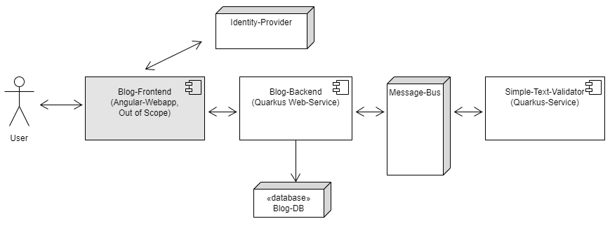

Showcase of a Blog-Backend-System powered by Quarkus

# Overview

The distributed systems contains following services:  
 - Testing-Keycloak-Instance as "Identity Provider" from hftm-lab on Azure
 - Quarkus-Container as "Blog-Backend" (project in sub-directory blog-backend)
 - MySQL-Container as "Database" for the Blog-Backend
 - Redpanda-Container as "Message-Bus" (simple and efficient kafka-broker)
 - Quarkus-Container as "Simple-Text-Validator" (project in sub-directory text-validator)

# How to Start the Containers

## Setup Docker Network  

    docker network create blog-nw

## Start and configure Redpanda as Kafka-Broker  

    docker run -d --name=redpanda-1 -p 9092:9092 --network blog-nw -d docker.redpanda.com/vectorized/redpanda:v22.1.7 redpanda start --overprovisioned --smp 1 --check=false --memory 1G --reserve-memory 0M --node-id 0 --kafka-addr 0.0.0.0:9092 --advertise-kafka-addr redpanda-1:9092
    docker exec -it redpanda-1 rpk topic create validation-request --brokers=localhost:9092
    docker exec -it redpanda-1 rpk topic create validation-response --brokers=localhost:9092

## Keycloak  
Testing-Keycloak-Instance from hftm-lab on Azure is used and nothing needs do be started.

## Start MySQL-Container

    docker run --name blog-mysql -p 3306:3306 --network blog-nw -e MYSQL_ROOT_PASSWORD=vs4tw -e MYSQL_USER=dbuser -e MYSQL_PASSWORD=dbuser -e MYSQL_DATABASE=blogdb -d mysql:8.0

## Start Validation-Service
Build docker-image according Readme in Project in sub-directory. After this, start the container like this:  

    docker run -i --rm --network blog-nw -e KAFKA_BOOTSTRAP_SERVERS=redpanda-1:9092 -d demo/text-validator:latest

## Start Blog-Backend
Build docker-image according Readme in Project in sub-directory. After this, start the container like this:  

    docker run -i --rm -p 8080:8080 --network blog-nw -e KAFKA_BOOTSTRAP_SERVERS=redpanda-1:9092 -e QUARKUS_DATASOURCE_USERNAME=dbuser -e QUARKUS_DATASOURCE_PASSWORD=dbuser -e QUARKUS_DATASOURCE_JDBC_URL=jdbc:mysql://blog-mysql:3306/blogdb -d demo/blog-backend:latest

## Access the Blog-Backend over the Swagger-UI  
http://localhost:8080/q/swagger-ui

## Create a Access-Token from hftm-Lab-Keycloak

Example Access over httpie with the User Alice: (Blog-Admin)

    http -v --form --auth backend-service:OtCiMqpmzkPUVwsN51ZXieXxZ9KmGerj POST https://d-cap-keyclaok.kindbay-711f60b2.westeurope.azurecontainerapps.io/realms/blog/protocol/openid-connect/token username=alice password=alice grant_type=password

This Token can also be used in the Swagger-UI.

## httpie Example-Access  
Access without Token:
    
    http :8080/entries

Example with access-token:  

    http --session=auth-user :8080/entries Authorization:"Bearer ACCESS-TOKEN"
    http --session=auth-user :8080/entries title="Neuer Titel" content=Inhalt  Authorization:"Bearer ACCESS-TOKEN"